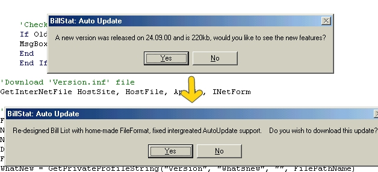



## Auto Update in 1 line of code

### Description

This module will download a referance file (included, see usage) and check

the values from that against current ones. It will then ask the user if they

wish to see information on the Update and then if they wish to download it.

If 'yes' then an file is downloaded off the Internet (should be a Self

Extracting Zip/EXE for ease of use).

Please leave a quick comment and rate this so I can make better versions.
 
### More Info
 

             |
---                |---
**Submitted On**   |2000-11-05 17:57:58
**By**             |[Sam Truscott](https://github.com/Planet-Source-Code/PSCIndex/blob/master/ByAuthor/sam-truscott.md)
**Level**          |Beginner
**User Rating**    |4.5 (18 globes from 4 users)
**Compatibility**  |VB 5\.0, VB 6\.0
**Category**       |[Internet/ HTML](https://github.com/Planet-Source-Code/PSCIndex/blob/master/ByCategory/internet-html__1-34.md)
**World**          |[Visual Basic](https://github.com/Planet-Source-Code/PSCIndex/blob/master/ByWorld/visual-basic.md)
**Archive File**   |[CODE\_UPLOAD113241152000\.zip](https://github.com/Planet-Source-Code/sam-truscott-auto-update-in-1-line-of-code__1-12551/archive/master.zip)

